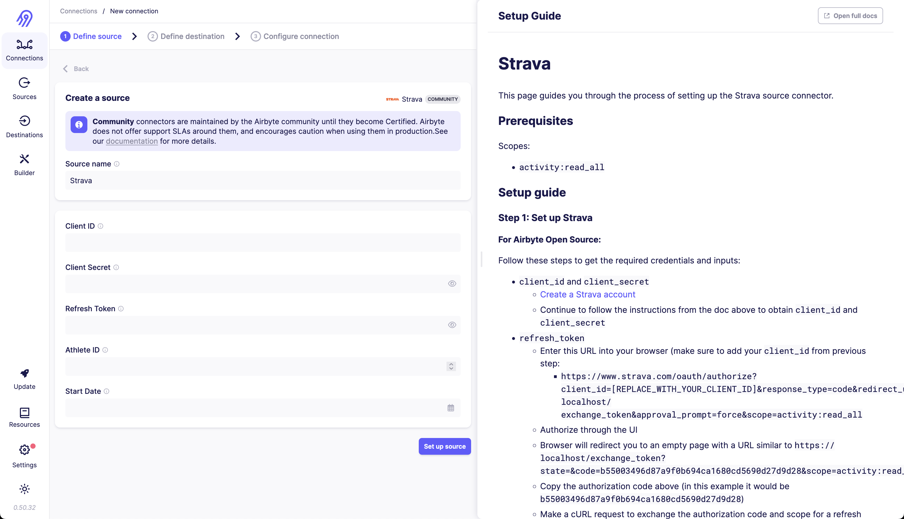
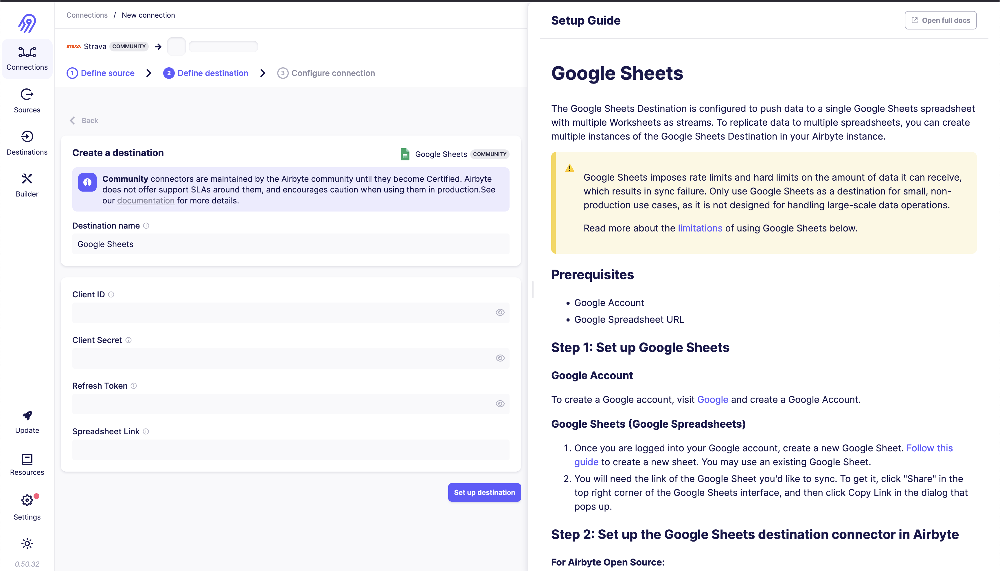
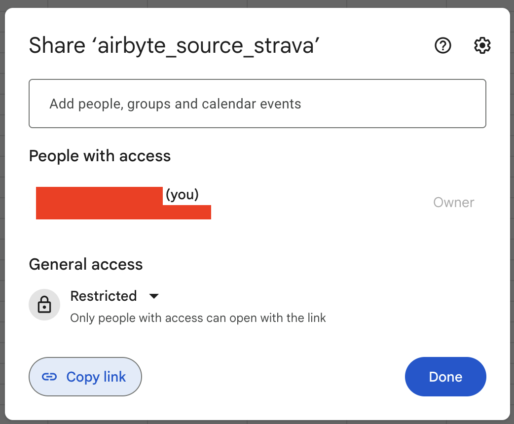
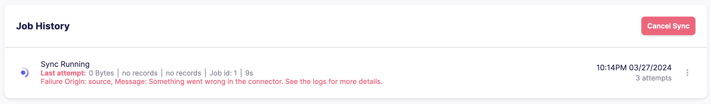
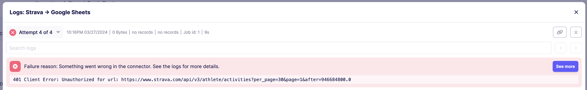

# Getting my feet wet with Airbyte

I'll be testing out [Airbyte](https://airbyte.io/) to get a feel for what a "Hello World" example would look like. I find exercises like these to be helpful when first familiarizing myself with a new tool. Oftentimes, the setup that is used in production in an already established project can be overwhelming. A "toy example" usually gives me a good sense of what part of the setup is "vanilla"/"boilerplate" and what part is specific to the project.

## Running Airbyte locally

Following the instructions [here](https://docs.airbyte.com/deploying-airbyte/local-deployment), it seems pretty straightforward:

```bash
# clone Airbyte from GitHub
git clone --depth=1 https://github.com/airbytehq/airbyte.git

# switch into Airbyte directory
cd airbyte

# start Airbyte
./run-ab-platform.sh
```

Now, I'll open up [http://localhost:8000](http://localhost:8000) and add my first connection: Strava.



All the information I need to connect to Strava I found under [Settings>My API Application](https://www.strava.com/settings/api). I had already created an application, so I just needed to copy the `Client ID`, `Client Secret`, and `Refresh Token`\*. `Athlete ID` can be found when navigating to your profile and looking at the URL. The tests passed, yay!

> \*Not so fast! The connection ended up not working. The `Refresh Token` was scoped to `read` and not `activity:read_all`. This was clearly stated in the Airbyte instructions (you can even see it in the screenshot above!). I followed the steps of getting the `refresh_token`, edited the corresponding field and saved/tested the connection again.

Now, I'll add a destination: Google Sheets.



I followed the instructions to create a Google Sheet and a new Google Cloud project which I named `airbyte`. I enabled the Google Sheets API. I created an OAuth consent screen, only filling in the required fields, to be able to create a new OAuth client ID.

I also needed to add myself under "Test users" for the OAuth consent screen, otherwise clicking Authorize APIs in the OAuth playground would give me an error.

Back in the Airbyte UI, I pasted the `Client ID` and `Client Secret` from the "Client ID for Web application" page, the `Refresh Token` from the OAuth playground's second step, and the `Spreadsheet Link` from the Google Sheet/Drive "Share">"Copy Link" button



After selecting the data I wanted to sync (activities), I clicked save and the sync started after a few seconds. Unfortunately, checking Job
History I could see some failed attempts:



I'll need to investigate further to see what went wrong. I'll start by checking the logs in the Airbyte UI. In the very top, I see

```
401 Client Error: Unauthorized for url: https://www.strava.com/api/v3/athlete/activities?per_page=30&page=1&after=946684800.0
```



I'll need to double check my connection... Entering the Strava source configuration screen, I quickly saw that I had not used the correct `refresh_token`, and instead created the correct one by following the instructions this time... See the above note.

> If you, like me, copy-pasted the instruction's `curl` command directly and got something like
>
> ```
> curl: (3) URL rejected: Bad hostname
> curl: (3) URL rejected: Malformed input to a URL function
>
> ```
>
> Just make sure to clean the commands of any `\` characters!

```bash
curl -X POST https://www.strava.com/oauth/token -F client_id=YOUR_CLIENT_ID -F client_secret=YOUR_CLIENT_SECRET -F code=AUTHORIZATION_CODE -F grant_type=authorization_code
```

Triggering the sync again, it quickly succeeded and I could see the activities in my Google Sheet under a new tab named `activities`!
