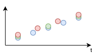
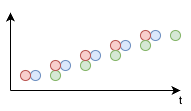

# Dynamic Time Warping

Dynamic Time Warping (DTW) is a powerful algorithm that is used to measure the similarity between two sequences that may vary in time or speed. It is used in a variety of fields such as speech recognition, data mining, and bioinformatics. In this post, I will discuss a variation of DTW that can be useful for particular types of data.

The standard DTW algorithm is used to measure the similarity between two sequences. It is a dynamic programming algorithm that finds the optimal alignment between two sequences. The algorithm is based on the idea that the optimal alignment between two sequences is the one that minimizes the total distance between the corresponding elements of the sequences.

The standard DTW algorithm is defined as follows:

Given two sequences X and Y, where X = {x1, x2, ..., xn} and Y = {y1, y2, ..., ym}, the DTW distance between X and Y is defined as the minimum distance between all possible alignments of X and Y. The distance between two elements xi and yj is defined as the Euclidean distance between xi and yj.

The standard DTW algorithm has a time complexity of O(nm), where n and m are the lengths of the two sequences. This makes it impractical for large sequences. However, there are several variations of DTW that have been developed to address this issue.

## Sakoe-Chiba band algorithm

One such variation is the Sakoe-Chiba band algorithm. This algorithm restricts the search space for the optimal alignment, which reduces the time complexity of the algorithm. The Sakoe-Chiba band algorithm is defined as follows:

Given two sequences X and Y, where X = {x1, x2, ..., xn} and Y = {y1, y2, ..., ym}, the DTW distance between X and Y is defined as the minimum distance between all possible alignments of X and Y, subject to the constraint that the alignment must lie within a band of width w. The distance between two elements xi and yj is defined as the Euclidean distance between xi and yj.

The Sakoe-Chiba band algorithm has a time complexity of O(nw), where n is the length of the longer sequence and w is the width of the band. This makes it more practical for large sequences.

## Fast DTW

Another variation of DTW that has been developed to address the time complexity issue is the Fast DTW algorithm. This algorithm is based on the idea that the optimal alignment between two sequences can be approximated by finding the optimal alignment between a down-sampled version of the sequences. The Fast DTW algorithm is defined as follows:

Given two sequences X and Y, where X = {x1, x2, ..., xn} and Y = {y1, y2, ..., ym}, the Fast DTW distance between X and Y is defined as the minimum distance between all possible alignments of a down-sampled version of X and a down-sampled version of Y. The distance between two elements xi and yj is defined as the Euclidean distance between xi and yj.

## Custom DTW

In some cases, it may be necessary to develop a custom variation of DTW to address specific requirements. Such is the case with the data that I am working with. I am currently working on a project that involves measuring the similarity between two sequences of time series data and, most importantly, creating the mapping between them. The sequences are of different lengths and may vary in time or speed. The standard DTW algorithm is not suitable for this type of data, so I have developed a custom variation of DTW that is tailored to the specific requirements of the project.

### Assumptions

The custom variation of DTW that I have developed is based on the fact that both signals are a measurement of the same phenomenon/physical process.

1. The sequences are of different lengths.
1. The sequences may be shifted in time.
1. The sequences may be scaled (compressed or stretched) in time.
   1. The scale factor is constant.
   1. The scale factor is not known.

#### 1. The sequences are of different lengths

The sequences are of different lengths. This means that the sequences may have different numbers of data points. In the figure below, all three sequences describe the same series with the same start and end points, but they have different number of data points (blue: 5, red: 4, green: 3).
This can, for example, be due to different sampling rates.

> ℹ️ Note that the points are offset for better visibility.

#### 2. The sequences may be shifted in time

The sequences may be shifted in time. This means that the sequences' data points may be offset relative to each other. In the figure below, all three sequences describe the same series, but they are shifted (red: -1 time unit, green: +2 time units relative blue).
This can, for example, be due to unsynchronized clocks.

#### 3. The sequences may be scaled in time

The sequences may be scaled (compressed or stretched) in time. This means that the sequences' data points may be 